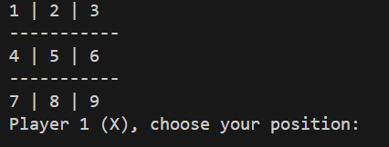
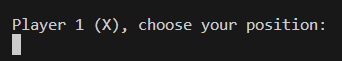
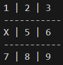
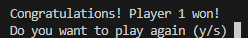

# Tic-Tac-Toe
A simple Tic-Tac-Toe game in C++ played in the terminal. This little game is based on a [Neps Academy](https://neps.academy/br/dashboard) project with the same name ([Tic-Tac-Toe](https://neps.academy/project/22))

## Playing Tic-Tac-Toe
At the beginning, we have a 3x3 board, numbered from 1 to 9, like this:


---

Now it's time for the first player (X) to choose one of the nine positions (making sure to not pick an already marked one). <br />


---

Once the position is choosen, the board updates: <br />


---

Then the second player (O) has to choose one remaining position, the game continues like this until someone wins or it ends in a draw. WHen that happens, a message like this will appear: <br />


---

## What is needed to play
- To play Tic-Tac-Toe, you'll need the GCC compiler instaled on your system, so in case you don't have it installed yet, check it out here: [GCC Compilator](https://gcc.gnu.org/install/)
- If you use Windows, you can learn how to install GCC here: [GCC on Windows](https://gcc.gnu.org/install/binaries.html)

Once you've installed the GCC compilator, now you can get the [Tic-Tac-Toe code](https://raw.githubusercontent.com/vitor-ash/tic-tac-toe/refs/heads/main/main.cpp). Now open your terminal and navigate to the folder where ```main.cpp``` is located is installed (e.g.: C:\Users\YourName\Documents\my_cpp_project\src\main.cpp on Windows). Use this command:
```cd <path-name>```
Now, you can run our Tic-Tac-Toe game like this:
```g++ main.cpp -o main.exe```
Now, just run our executable file:
```./main.exe```

---

## Licence
This project is licensed under the MIT license. For more information, see the [License](LICENSE) file.